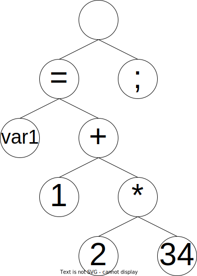

# コンパイラとは何か？

---

# アジェンダ

1. アプリケーション作成時の流れ
  1.1. sln → アプリケーション
  1.2. C/C++具体例
2. コンパイル時の流れ
  2.1. 字句解析
  2.2. 構文解析
  2.3. 意味解析
3. 構文解析についてもう少し詳しく
  3.1. 抽象構文木
  3.2. BNF（バッカス・ナウア記法）

---

# 1. アプリケーション作成時の流れ

---
<!--
header: "**1．アプリケーション作成時の流れ**"
-->

## 1.1.  sln → アプリケーション


ソリューションファイルをIDEで開き、ビルドするとアプリケーションができる。

---

## 1.1.  sln → アプリケーション


具体的には、ソリューションに登録された各プロジェクトをIDEでビルドすると、EXEファイルやDLLファイルができる。
このEXEファイルやDLLファイルの組み合わせでアプリケーションが構成される。

---

ビルドとは？

---

## 1.2. C/C++具体例


.vcxproj（C/C++プロジェクトファイル）をビルドしてEXEファイルを出力するケースの具体例を見る。

---

## 1.2. C/C++具体例


ソースファイル群をコンパイルして得た中間コードをリンカでまとめてEXEファイルを出力している。

---

## 1.2. C/C++具体例


ソースファイル群をコンパイルして得た中間コードをリンカでまとめてEXEファイルを出力している。

---

（この例では）コンパイラは、ソースファイルを中間コードに変換するもの。

C/C++ファイルをコンパイルするC/C++コンパイラ以外に、Windowsアプリ作成時はリソースファイルをコンパイルするリソースコンパイラもある。
　※ヘッダファイルはコンパイルの対象外

中間コードをまとめて実行ファイルを作成するのは別のツール（リンカ）の仕事。

このプロセスをまとめて実行しているのがビルド。

---
<!--
header: ""
-->

# 2. コンパイル時の流れ

---
<!--
header: "**2．コンパイル時の流れ**"
-->

ソースコード
　　│
　　│
　　│
　　│
　　↓
中間コード

---

ソースコード
　　↓　**字句解析**
トークンリスト
　　↓　**構文解析**
構文木
　　↓　**意味解析**
中間コード

---

## 2.1. 字句解析
ソースコードの文字列を、言語的に意味のある最小単位（字句・トークン）に分割する処理。

```c
var1 = 1 + 2 * 34;
```
&nbsp;　　　　　　↓
`var1` `=` `1` `+` `2` `*` `34` `;`

&nbsp;

`var1` を `var` と `1` に分けたり、`34` を `3` と `4` に分けたりは一般的にしない。
同様に、`+` と `2` をつなげて `+2` とすることも無い。
　※ -1 は字句解析では `-` と `2` に分けることが多い。
　　 ただし、1.0e+1（浮動小数点数の指数表記）は `1.0e+1` の１トークンとなる。
半角スペースや改行を入れたら解釈できなるところが「最小単位」と考えられる。

---
<!--
style: img { margin: auto; display: inline; }
-->

## 2.2. 構文解析
字句解析結果のトークンリストを、言語構文に則った木構造を生成する。
`var1` `=` `1` `+` `2` `*` `34` `;`
　 　↓

演算子の優先順位は木構造で表現可能。
if文やfor文といった制御構文も木構造で表現する。

---

## 2.3. 意味解析
構文解析結果の構文木を、言語的な意味として解釈して中間コードを生成する。

　　↓
```asm
mov         eax,2
imul        eax,34
add         eax,1
mov         dword ptr [var1],eax  
```

C/C++ではソースファイルを１つずつコンパイルするので、この時点ではまだ他のソースファイルに記述されている関数を呼び出すアセンブラは出力できない（飛び先のアドレスが不明のため）。このアドレス解決などがリンカの仕事となる。

---
<!--
header: ""
-->

# 3. 構文解析についてもう少し詳しく

---
<!--
header: "**3. 構文解析についてもう少し詳しく**"
-->

## 3.1. 抽象構文木

意味解析に必要ない要素を省略したり、意味解析しやすいように形を変えた構文木。

（具象）構文木との差分例は以下。
* コメントの省略（コメントの有無は意味解析と無関係）
* 丸括弧の省略（木の構成で演算順を表現可能）
* 構文上省略された要素の補完（for文の条件式など）
  ※関数のデフォルト引数はここで補完するものではないので注意！
  　（それは意味解析で行う内容）

---

## 3.2. BNF（バッカス・ナウア記法）

構文定義に用いられるメタ言語。

例）The syntax of C in Backus-Naur Form [https://cs.wmich.edu/...form.htm](https://cs.wmich.edu/~gupta/teaching/cs4850/sumII06/The%20syntax%20of%20C%20in%20Backus-Naur%20form.htm)
```html
<translation-unit> ::= {<external-declaration>}*

<external-declaration> ::= <function-definition>
                         | <declaration>

<function-definition> ::= {<declaration-specifier>}* <declarator> {<declaration>}* <compound-statement>

<declaration-specifier> ::= <storage-class-specifier>
                          | <type-specifier>
                          | <type-qualifier>

<storage-class-specifier> ::= auto
                            | register
                            | static
                            | extern
                            | typedef
```
